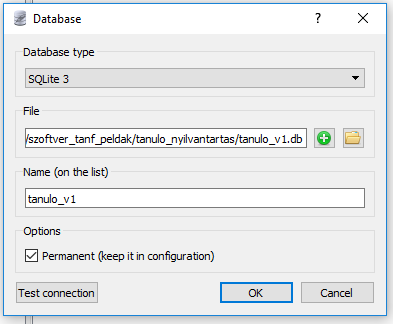

# Adatbázisok kezelése Sqlite-al és C#-al
---
## Adatbázis létrehozása az SqliteStudio-val

Egyszerű egy táblából álló adatbázist készítünk.

### A feladatok:
- [ ] Új adatbázis létrehozása
- [ ] Adattábla létrehozása
- [ ] Néhány rekord felvitele, hogy legyen mit lekérdezni
---
#### Az új adatbázis létrehozása

**Database->Add a database**
**Database Type**:Sqlite3
**File**: A zöld **+**-on kell kattintani mappát választani, adabázis fájl nevét megadni.

#### Adattábla létrehozása
Az adattábla a következő oszlopokból fog állni:
+ Id ( A tanuló tábla elsődleges kulcsa)
+ VezetekNev
+ KeresztNev
+ AnyjaNeve
+ SzuletesEve
+ SzuletesiHely

