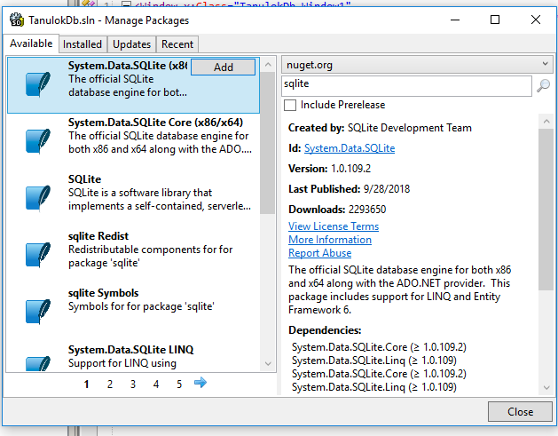

# Adatbázisok kezelése Sqlite-al és C#-al
---
## Adatbázis létrehozása az SqliteStudio-val

Egyszerű egy táblából álló adatbázist készítünk.

### A feladatok:
- [ ] Új adatbázis létrehozása
- [ ] Adattábla létrehozása
- [ ] Néhány rekord felvitele, hogy legyen mit lekérdezni
---
#### Az új adatbázis létrehozása

**Database->Add a database**
**Database Type**:Sqlite3
**File**: A zöld **+**-on kell kattintani mappát választani, adabázis fájl nevét megadni.


#### Adattábla létrehozása
Az adattábla a következő oszlopokból fog állni:
+ Id ( A tanuló tábla elsődleges kulcsa)
+ VezetekNev
+ KeresztNev
+ AnyjaNeve
+ SzuletesEve
+ SzuletesiHely

A **Tables**-on jobb gomb, majd **Create table**

**Table name**: tanulok

Kattintani az **Add column** gombra

**Column name**:Id

**Data type**:integer

Bejelölni a továbbiakat:

- [x] Primary Key
- [x] Not NULL

A Primary Key mellett a **Configure** gombra kattintani, majd itt bejelölni

- [x] Autoincrement
- [x] On Conflict :Abort


A következő mező a **VezetekNev**

Kattintani az **Add column** gombra

**Column name**:VezetekNev

**Data type**:varchar, **Size**:50

Bejelölni a továbbiakat:

- [x] Not NULL

A többi szöveget tartalmazó mező beállítása ugyanaz.

A **SzuletesEve** mező integer legyen.

Ha megvan akkor **Commit structure changes**-gombra kattintva a tábla létrejön.


Megnézhetjük, hogy milyen SQL-utasítást készít a program:


#### Rekordok felvitele

A **Tanulok** táblán jobb gomb, majd **Generate query for table** **INSERT**

Kapunk egy nyers INSERT Sql utasítást, csak kicsit át kell írni.
Az **Id**-t kivesszük, hiszen **Auto Increment**-et használunk. A többi értelemszerű.


Készüljön 4-5 rekord!

# Az előbbi adatbázis kezelése C#-ból

## Új solution: TanulokDb

Készítsünk egy új Wpf solution-t.

Ahhoz, hogy egy Sqlite adatbázist használni tudjunk a programból, pár dolgot telepíteni kell.

A projekten/solution-on jobb gomb, majd **Manage Packages**

A keresőbe beírni: **Sqlite**, és a **System.Data.Sqlite(x86/x64)**-et választani.



## A feladatok
- [ ] Valamilyen felület kreálása, adatlekérdezés, és betöltés valamilyen Control-ba (célszerű egy DataGrid-et csinálni)
- [ ] Adatfelvitel megvalósítása
- [ ] Adat módosításának megvalósítása

### Egyszerű select lekérdezés kódolása

Először is, nem lesz annyira egyszerű :) Nem maga a lekérdezés kivitelezése probléma, hanem az ad munkát, hogy a lekérdezés eredményét átömlesszük valami olyan adatszerkezetbe, amelyet a DataGrid meg tud jeleníteni.

#### Először készítünk egy Db nevű osztályt, nem kódolunk bele az ablakba.

Most is érdemes Dependency Injection-el átadni a Db osztálynak az ablakot, így könnyen elérhető majd a Grid, vagy valami más elem.

Adjunk hozzá a projekthet egy új osztályt **New Item-Class**. A neve legyen **Db**

A kiindulási állapot:

```C#
using System;
using System.Data.SQLite;
using System.Collections.Generic;
using System.Linq;
using System.Windows.Media;
using System.Windows.Controls;
using System.Windows;
using System.Diagnostics;
using System.Data;

namespace TanulokDb
{
	/// <summary>
	/// Description of Db.
	/// </summary>
	public class Db
	{	
		public Db()
		{
						
		}
		
	}
}
```
Először gondoskodni kell az ablak átadásáról, a Db osztályban deklaráljuk ezt:

```C#
public class Db
	{
		Window1 window1;
		
		public Db(Window1 window)
		{
			this.window1=window;
			
		}
	}	
```
Az ablak függvényébe pedig ez kell:

```C#
public partial class Window1 : Window
	{
		Db db;
		public Window1()
		{
			InitializeComponent();
			db=new Db(this);
			
		}
	}
```
Így már elérhető lesz az ablak.

Hozzunk létre az XAML-ben egy DataGrid-et. Hagyjuk az automatikus oszlopgenerálást.

```XAML
<Window x:Class="TanulokDb.Window1"
	xmlns="http://schemas.microsoft.com/winfx/2006/xaml/presentation"
	xmlns:x="http://schemas.microsoft.com/winfx/2006/xaml"
	Title="TanulokDb" Height="500" Width="300"
	>
	<Grid>
		<DataGrid x:Name="adatok" AutoGenerateColumns="True" ColumnWidth="*" />
	</Grid>
</Window>
```


